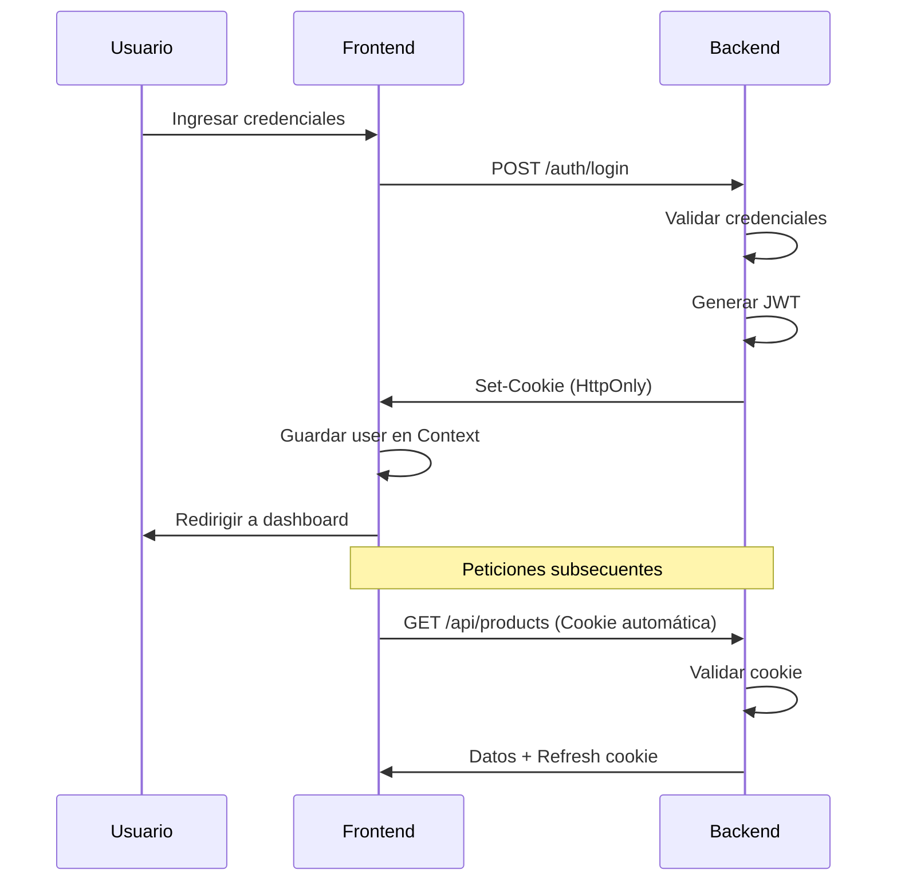

<div align="center">

# 🔥 RIFLI Frontend

### Plataforma E-Commerce y Gestión de Presupuestos Profesionales

[](https://reactjs.org/)
[](https://vitejs.dev/)
[](https://axios-http.com/)
[](https://sass-lang.com/)

**Sistema moderno de comercio electrónico especializado en servicios profesionales de electricidad, gas y seguridad**

[Documentación](#-documentación) •
[Características](#-características-principales) •
[Instalación](#-inicio-rápido) •
[Arquitectura](#-arquitectura)

</div>

---

## 📋 Tabla de Contenidos

- [🎯 Características Principales](#-características-principales)
- [🏗️ Arquitectura](#-arquitectura)
- [🔐 Autenticación y Seguridad](#-autenticación-y-seguridad)
- [🚀 Inicio Rápido](#-inicio-rápido)
- [📁 Estructura del Proyecto](#-estructura-del-proyecto)
- [🔧 Tecnologías](#-tecnologías)
- [🎨 UI/UX](#-uiux)
- [📚 Documentación](#-documentación)
- [🧪 Testing](#-testing)
- [🏗️ Build y Deploy](#-build-y-deploy)
- [🤝 Contribución](#-contribución)

---

## 🎯 Características Principales

### 🛡️ Sistema de Autenticación Robusto
- **Autenticación basada en cookies HttpOnly** (protección XSS)
- Login/Register/Password Recovery con validación en tiempo real
- Modal de login para acceso rápido sin interrumpir navegación
- Páginas dedicadas de autenticación con diseño moderno
- Refresh token automático
- Rutas protegidas con control de roles (customer/admin)

### 🛒 E-Commerce Completo
- Catálogo de productos con filtros avanzados
- Carrito de compras persistente
- Sistema de órdenes con seguimiento
- Integración con pasarelas de pago (MercadoPago/Stripe)
- Gestión de direcciones de envío

### 💼 Sistema de Presupuestos
- Solicitud de presupuestos para servicios profesionales
- Formularios dinámicos según tipo de servicio
- Sistema de mensajería entre cliente y proveedor
- Estados de presupuesto (pendiente, en revisión, aceptado, rechazado)
- Notificaciones en tiempo real

### 📊 Dashboard Adaptativo
- Dashboard personalizado según rol de usuario
- Vista de cliente: estadísticas personales, órdenes recientes, presupuestos
- Vista de admin: métricas del negocio, gestión completa
- Diseño modular con composición de componentes
- Glassmorphism UI con animaciones suaves

### 🎨 Experiencia de Usuario Premium
- Diseño responsive mobile-first
- Animaciones suaves con respeto a `prefers-reduced-motion`
- Tipografía fluida con `clamp()`
- Efectos hover modernos (glassmorphism, neumorphism)
- Lazy loading de imágenes
- Optimización de performance

---

## 🏗️ Arquitectura

### Patrón de Diseño: **Feature-Based Architecture**
```
┌─────────────────────────────────────────────────────────┐
│                      PRESENTATION                        │
│  (React Components - UI/UX - Pages/Components)          │
├─────────────────────────────────────────────────────────┤
│                    BUSINESS LOGIC                        │
│  (Custom Hooks - State Management - Context API)        │
├─────────────────────────────────────────────────────────┤
│                     DATA ACCESS                          │
│  (Services Layer - Axios - API Communication)           │
├─────────────────────────────────────────────────────────┤
│                        UTILS                             │
│  (Helpers - Formatters - Constants - Validators)        │
└─────────────────────────────────────────────────────────┘
```

### Principios Aplicados

- ✅ **Separation of Concerns**: Cada capa tiene una responsabilidad única
- ✅ **Single Responsibility Principle**: Componentes pequeños y enfocados
- ✅ **DRY (Don't Repeat Yourself)**: Lógica reutilizable en hooks y utils
- ✅ **Composition over Inheritance**: Páginas compuestas de componentes
- ✅ **Container/Presentational Pattern**: Separación de lógica y UI
- ✅ **Custom Hooks Pattern**: Encapsulación de lógica reutilizable

---

## 🔐 Autenticación y Seguridad

### 🍪 Cookies HttpOnly

El sistema utiliza **cookies HttpOnly** para máxima seguridad:

#### Configuración Backend Requerida
```javascript
// Express.js + Cookie-Parser
import cookieParser from 'cookie-parser';
import cors from 'cors';

app.use(cors({
  origin: process.env.FRONTEND_URL,
  credentials: true // ← CRÍTICO
}));

app.use(cookieParser());

// Login endpoint
app.post('/auth/login', async (req, res) => {
  const { email, password } = req.body;
  
  // Validar credenciales...
  const user = await User.findOne({ email });
  const token = generateJWT(user);
  
  res.cookie('token', token, {
    httpOnly: true,      // No accesible desde JavaScript (XSS protection)
    secure: true,        // Solo HTTPS en producción
    sameSite: 'strict',  // Protección CSRF
    maxAge: 7 * 24 * 60 * 60 * 1000 // 7 días
  });
  
  res.json({ user: sanitizeUser(user) });
});

// Middleware de autenticación
app.use('/api/protected', (req, res, next) => {
  const token = req.cookies.token;
  if (!token) return res.status(401).json({ error: 'No autorizado' });
  
  try {
    const decoded = jwt.verify(token, process.env.JWT_SECRET);
    req.user = decoded;
    next();
  } catch (error) {
    res.status(401).json({ error: 'Token inválido' });
  }
});
```

#### Configuración Frontend
```javascript
// src/services/api.js
import axios from 'axios';

const api = axios.create({
  baseURL: process.env.VITE_API_URL,
  withCredentials: true // ← Envía cookies automáticamente
});

// Interceptor para auto-refresh
api.interceptors.response.use(
  response => response,
  async error => {
    if (error.response?.status === 401 && !error.config._retry) {
      error.config._retry = true;
      await api.post('/auth/refresh');
      return api(error.config);
    }
    return Promise.reject(error);
  }
);
```

### Protecciones Implementadas

| Amenaza | Protección | Implementación |
|---------|------------|----------------|
| **XSS** | HttpOnly cookies | `httpOnly: true` |
| **CSRF** | SameSite cookies | `sameSite: 'strict'` |
| **MITM** | HTTPS only | `secure: true` (producción) |
| **Session Hijacking** | Short-lived tokens | Refresh token cada 15 min |
| **Token exposure** | No localStorage | Cookies exclusivamente |

### Flujo de Autenticación


---

## 🚀 Inicio Rápido

### Prerrequisitos

- **Node.js**: v18.0.0 o superior
- **npm**: v9.0.0 o superior (o yarn/pnpm)
- **Backend**: Servidor API corriendo (ver requisitos de cookies)

### Instalación
```bash
# 1. Clonar repositorio
git clone https://github.com/tu-usuario/rifli-frontend.git
cd rifli-frontend

# 2. Instalar dependencias
npm install

# 3. Configurar variables de entorno
cp .env.example .env
# Editar .env con tus configuraciones

# 4. Iniciar servidor de desarrollo
npm run dev

# La aplicación estará disponible en http://localhost:5173
```

### Variables de Entorno
```env
# .env.example

# API Backend
VITE_API_URL=http://localhost:5000/api/v1

# Pasarelas de Pago
VITE_MERCADOPAGO_PUBLIC_KEY=TEST-xxxxxxxx-xxxx-xxxx-xxxx-xxxxxxxxxxxx
VITE_STRIPE_PUBLIC_KEY=pk_test_xxxxxxxxxxxxxxxxxxxx

# Almacenamiento de Archivos
VITE_CLOUDINARY_CLOUD_NAME=tu_cloud_name
VITE_CLOUDINARY_UPLOAD_PRESET=tu_preset

# Configuración de App
VITE_APP_NAME=RIFLI
VITE_APP_URL=http://localhost:5173

# Producción
# VITE_API_URL=https://api.tudominio.com/api/v1
```

---

## 📁 Estructura del Proyecto
```
frontend/
├── public/                          # Archivos estáticos
│   ├── favicon.ico
│   └── logo.png
│
├── src/
│   ├── assets/                      # Recursos multimedia
│   │   ├── images/                  # Imágenes
│   │   │   ├── hero/
│   │   │   ├── products/
│   │   │   └── services/
│   │   └── icons/                   # Iconos/SVGs
│   │       └── Logo.jsx
│   │
│   ├── components/                  # Componentes reutilizables
│   │   ├── common/                  # Componentes base
│   │   │   ├── Button.jsx           # Botón reutilizable
│   │   │   ├── Input.jsx            # Input con validación
│   │   │   ├── Card.jsx             # Card genérica
│   │   │   ├── Modal.jsx            # Modal base
│   │   │   ├── Spinner.jsx          # Loading spinner
│   │   │   ├── Header.jsx           # Header principal
│   │   │   ├── Footer.jsx           # Footer principal
│   │   │   ├── Navbar.jsx           # Barra de navegación
│   │   │   └── Alert.jsx            # Alertas/notificaciones
│   │   │
│   │   └── auth/                    # Componentes de auth
│   │       ├── AuthModal.jsx        # Modal login/register
│   │       └── authModal.scss
│   │
│   ├── context/                     # React Context (estado global)
│   │   ├── AuthContext.jsx          # Autenticación
│   │   ├── CartContext.jsx          # Carrito
│   │   └── NotificationContext.jsx  # Notificaciones
│   │
│   ├── hooks/                       # Custom Hooks
│   │   ├── useAuth.js               # Hook de autenticación
│   │   ├── useCart.js               # Hook de carrito
│   │   ├── useProducts.js           # Hook de productos
│   │   ├── useOrders.js             # Hook de órdenes
│   │   ├── useQuotes.js             # Hook de presupuestos
│   │   ├── useServices.js           # Hook de servicios
│   │   ├── useNotifications.js      # Hook de notificaciones
│   │   ├── useUsers.js              # Hook de usuarios (admin)
│   │   ├── useAdminStats.js         # Hook de estadísticas admin
│   │   ├── useForm.js               # Hook de formularios
│   │   ├── useDebounce.js           # Hook de debounce
│   │   └── useLocalStorage.js       # Hook de localStorage
│   │
│   ├── pages/                       # Páginas principales
│   │   ├── home/                    # Landing page
│   │   │   ├── Home.jsx             # Componente principal
│   │   │   ├── hero/
│   │   │   │   ├── Hero.jsx
│   │   │   │   └── Hero.scss
│   │   │   ├── slider/
│   │   │   │   ├── Slider.jsx       # Slider de marcas
│   │   │   │   └── Slider.scss
│   │   │   └── servicesShowcase/
│   │   │       ├── ServicesShowcase.jsx
│   │   │       └── ServicesShowcase.scss
│   │   │
│   │   ├── dashboard/               # Dashboard usuario
│   │   │   ├── Dashboard.jsx        # Componente principal
│   │   │   ├── dashboard.scss
│   │   │   ├── dashboardCard/
│   │   │   │   ├── DashboardCard.jsx
│   │   │   │   └── DashboardCard.scss
│   │   │   └── dashboardHeader/
│   │   │       ├── DashboardHeader.jsx
│   │   │       └── DashboardHeader.scss
│   │   │
│   │   ├── auth/                    # Páginas de autenticación
│   │   │   ├── Login.jsx
│   │   │   ├── Register.jsx
│   │   │   ├── ForgotPassword.jsx
│   │   │   ├── auth.scss
│   │   │   └── components/
│   │   │       └── AuthPageLayout.jsx
│   │   │
│   │   ├── shop/                    # Tienda
│   │   │   ├── Shop.jsx
│   │   │   ├── ProductDetail.jsx
│   │   │   ├── Cart.jsx
│   │   │   └── Checkout.jsx
│   │   │
│   │   ├── services/                # Servicios
│   │   │   ├── Services.jsx
│   │   │   └── ServiceDetail.jsx
│   │   │
│   │   ├── user/                    # Perfil usuario
│   │   │   ├── Profile.jsx
│   │   │   ├── Orders.jsx
│   │   │   ├── Quotes.jsx
│   │   │   └── Addresses.jsx
│   │   │
│   │   └── admin/                   # Panel admin
│   │       ├── AdminPanel.jsx
│   │       ├── ProductManager.jsx
│   │       ├── OrderManager.jsx
│   │       ├── QuoteManager.jsx
│   │       ├── UserManager.jsx
│   │       └── Analytics.jsx
│   │
│   ├── routes/                      # Configuración de rutas
│   │   ├── AppRoutes.jsx            # Rutas principales
│   │   └── PrivateRoute.jsx         # HOC para rutas protegidas
│   │
│   ├── services/                    # Capa de API (Axios)
│   │   ├── api.js                   # Configuración base Axios
│   │   ├── authService.js           # Endpoints de auth
│   │   ├── userService.js           # Endpoints de usuarios
│   │   ├── productService.js        # Endpoints de productos
│   │   ├── cartService.js           # Endpoints de carrito
│   │   ├── orderService.js          # Endpoints de órdenes
│   │   ├── serviceService.js        # Endpoints de servicios
│   │   ├── quoteService.js          # Endpoints de presupuestos
│   │   ├── notificationService.js   # Endpoints de notificaciones
│   │   ├── fileService.js           # Endpoints de archivos
│   │   └── adminService.js          # Endpoints de admin
│   │
│   ├── styles/                      # Estilos globales
│   │   ├── global.css               # Estilos base
│   │   ├── variables.css            # Variables CSS
│   │   ├── reset.css                # CSS Reset
│   │   ├── utilities.css            # Clases utilitarias
│   │   └── breakpoints.scss         # Breakpoints responsive
│   │
│   ├── utils/                       # Utilidades
│   │   ├── constants.js             # Constantes de la app
│   │   ├── formatters.js            # Formateo de datos
│   │   ├── helpers.js               # Funciones auxiliares
│   │   ├── validation.js            # Validaciones
│   │   ├── localStorage.js          # Helpers de localStorage
│   │   └── cookies.js               # Helpers de cookies
│   │
│   ├── App.jsx                      # Componente raíz
│   ├── App.scss                     # Estilos del App
│   └── main.jsx                     # Entry point
│
├── .env                             # Variables de entorno (gitignored)
├── .env.example                     # Ejemplo de variables
├── .gitignore                       # Archivos ignorados
├── .eslintrc.cjs                    # Configuración ESLint
├── package.json                     # Dependencias
├── vite.config.js                   # Configuración Vite
├── README.md                        # Este archivo
└── index.html                       # HTML base
```

---

## 🔧 Tecnologías

### Core

| Tecnología | Versión | Propósito |
|------------|---------|-----------|
| **React** | 18.2+ | UI Library |
| **React Router DOM** | 6.20+ | Routing |
| **Axios** | 1.6+ | HTTP Client |
| **Vite** | 5.0+ | Build Tool |

### Styling

| Tecnología | Propósito |
|------------|-----------|
| **SCSS** | Preprocesador CSS |
| **CSS Modules** | CSS con scope local |
| **CSS Variables** | Theming dinámico |

### Utils

| Librería | Propósito |
|----------|-----------|
| **React Icons** | Iconos |
| **date-fns** | Manejo de fechas |
| **React Hook Form** | Formularios (opcional) |

### Development

| Herramienta | Propósito |
|-------------|-----------|
| **ESLint** | Linting |
| **Prettier** | Formateo |
| **Vitest** | Testing (preparado) |

---

## 🎨 UI/UX

### Sistema de Diseño

#### Paleta de Colores
```scss
:root {
  /* Primary */
  --accent-yellow: #ffca2c;
  --accent-yellow-hover: #ffd95a;
  --accent-yellow-transparent: rgba(255, 202, 44, 0.3);
  
  /* Backgrounds */
  --bg-dark: #000000;
  --bg-secondary: #0a0a0a;
  --bg-surface: #151515;
  --bg-card: #1a1a1a;
  
  /* Text */
  --text-primary: #ffffff;
  --text-secondary: #9ca3af;
  --text-muted: #6b7280;
  
  /* Status */
  --success: #10b981;
  --error: #ef4444;
  --warning: #f59e0b;
  --info: #3b82f6;
  
  /* Borders */
  --border: rgba(255, 255, 255, 0.08);
}
```

#### Tipografía Fluida
```scss
:root {
  /* Tamaños responsive con clamp() */
  --fz-title: clamp(2rem, 5vw + 1rem, 4rem);
  --fz-subtitle: clamp(1.7rem, 3vw + 0.5rem, 2.5rem);
  --fz-body: clamp(1rem, 1.5vw + 0.2rem, 1.25rem);
  
  /* Font Family */
  --font-primary: "Roboto", -apple-system, BlinkMacSystemFont, sans-serif;
}
```

#### Breakpoints
```scss
$breakpoints: (
  'mobile-sm': 375px,   // iPhone SE
  'mobile-md': 425px,   // Móviles grandes
  'mobile-lg': 768px,   // Tablets verticales
  'tablet': 1024px,     // Tablets horizontales
  'laptop': 1440px,     // Laptops
  'desktop': 1920px     // Monitores grandes
);
```

### Efectos Visuales

#### Glassmorphism
```scss
.glass-effect {
  background: rgba(255, 255, 255, 0.05);
  backdrop-filter: blur(12px);
  border: 1px solid rgba(255, 255, 255, 0.08);
  box-shadow: 0 8px 32px rgba(0, 0, 0, 0.3);
}
```

#### Neumorphism
```scss
.neuro-effect {
  background: #1a1a1a;
  box-shadow: 
    8px 8px 16px rgba(0, 0, 0, 0.5),
    -8px -8px 16px rgba(40, 40, 40, 0.5);
}
```

### Animaciones
```scss
/* Respeta prefers-reduced-motion */
@media (prefers-reduced-motion: reduce) {
  * {
    animation-duration: 0.01ms !important;
    animation-iteration-count: 1 !important;
    transition-duration: 0.01ms !important;
  }
}

/* Transiciones suaves */
.smooth-transition {
  transition: all 0.3s cubic-bezier(0.4, 0, 0.2, 1);
}
```

---

## 📚 Documentación

### Convenciones de Código

#### Nombrado de Archivos
```
Componentes:    PascalCase      Button.jsx, ProductCard.jsx
Hooks:          camelCase       useAuth.js, useProducts.js
Services:       camelCase       authService.js, productService.js
Utils:          camelCase       formatters.js, helpers.js
Pages:          PascalCase      Login.jsx, Dashboard.jsx
Styles:         match JS file   Button.scss, Dashboard.css
```

#### Estructura de Imports
```javascript
// 1. External libraries
import React, { useState, useEffect } from 'react';
import { useNavigate, Link } from 'react-router-dom';
import { FaShoppingCart } from 'react-icons/fa';

// 2. Services
import { productService } from '../services/productService';
import api from '../services/api';

// 3. Hooks
import { useAuth } from '../hooks/useAuth';
import { useCart } from '../hooks/useCart';

// 4. Context
import { AuthContext } from '../context/AuthContext';

// 5. Components
import Button from '../components/common/Button';
import ProductCard from '../components/shop/ProductCard';

// 6. Utils
import { formatCurrency, formatDate } from '../utils/formatters';
import { ROUTES, ORDER_STATUS } from '../utils/constants';

// 7. Styles
import './Component.scss';
```

#### Comentarios JSDoc
```javascript
/**
 * Hook personalizado para gestionar productos
 * @param {Object} filters - Filtros de búsqueda
 * @param {string} filters.category - Categoría
 * @param {number} filters.minPrice - Precio mínimo
 * @param {number} filters.maxPrice - Precio máximo
 * @returns {Object} Estado de productos
 * @returns {Array} products - Lista de productos
 * @returns {boolean} loading - Estado de carga
 * @returns {string|null} error - Mensaje de error
 * @returns {Function} refetch - Función para recargar
 */
export const useProducts = (filters = {}) => {
  // ...
};
```

### Ejemplos de Uso

#### Custom Hook
```javascript
// Uso de useProducts
import { useProducts } from '../hooks/useProducts';

function Shop() {
  const { products, loading, error, refetch } = useProducts({
    category: 'electricidad',
    minPrice: 0,
    maxPrice: 5000
  });

  if (loading) return <Spinner />;
  if (error) return <Alert type="error">{error}</Alert>;

  return (
    <div>
      {products.map(product => (
        <ProductCard key={product.id} product={product} />
      ))}
    </div>
  );
}
```

#### Service
```javascript
// Uso de productService
import { productService } from '../services/productService';

async function loadProducts() {
  try {
    const products = await productService.getAll({
      page: 1,
      limit: 20,
      category: 'gas'
    });
    console.log(products);
  } catch (error) {
    console.error('Error:', error);
  }
}
```

#### Context
```javascript
// Uso de AuthContext
import { useAuthContext } from '../context/AuthContext';

function Header() {
  const { user, logout, openLoginModal } = useAuthContext();

  return (
    <header>
      {user ? (
        <>
          <span>Hola, {user.name}</span>
          <button onClick={logout}>Salir</button>
        </>
      ) : (
        <button onClick={() => openLoginModal()}>Iniciar Sesión</button>
      )}
    </header>
  );
}
```

---

## 🧪 Testing

### Configuración (Preparado)
```javascript
// vite.config.js
import { defineConfig } from 'vite';
import react from '@vitejs/plugin-react';

export default defineConfig({
  plugins: [react()],
  test: {
    globals: true,
    environment: 'jsdom',
    setupFiles: './src/tests/setup.js',
  },
});
```

### Comandos
```bash
npm run test          # Ejecutar tests
npm run test:watch    # Watch mode
npm run test:ui       # UI de Vitest
npm run test:coverage # Reporte de cobertura
```

### Ejemplo de Test
```javascript
// src/hooks/__tests__/useAuth.test.js
import { renderHook, act } from '@testing-library/react-hooks';
import { useAuth } from '../useAuth';

describe('useAuth', () => {
  it('should login successfully', async () => {
    const { result } = renderHook(() => useAuth());

    await act(async () => {
      await result.current.login({
        email: 'test@test.com',
        password: 'password123'
      });
    });

    expect(result.current.user).toBeDefined();
    expect(result.current.error).toBeNull();
  });
});
```

---

## 🏗️ Build y Deploy

### Build de Producción
```bash
# Build optimizado
npm run build

# Preview del build
npm run preview

# Analizar bundle size
npm run build -- --mode analyze
```

### Variables de Entorno por Ambiente
```bash
# .env.development
VITE_API_URL=http://localhost:5000/api/v1

# .env.production
VITE_API_URL=https://api.tudominio.com/api/v1
```

### Deploy

#### Vercel
```bash
npm install -g vercel
vercel --prod
```

#### Netlify
```bash
npm run build
netlify deploy --prod --dir=dist
```

#### Docker
```dockerfile
# Dockerfile
FROM node:18-alpine AS build
WORKDIR /app
COPY package*.json ./
RUN npm ci
COPY . .
RUN npm run build

FROM nginx:alpine
COPY --from=build /app/dist /usr/share/nginx/html
COPY nginx.conf /etc/nginx/conf.d/default.conf
EXPOSE 80
CMD ["nginx", "-g", "daemon off;"]
```

---

## 🤝 Contribución

### Workflow de Git
```bash
# 1. Crear rama para feature
git checkout -b feature/nueva-funcionalidad

# 2. Hacer cambios y commits
git add .
git commit -m "feat: descripción del cambio"

# 3. Push a remoto
git push origin feature/nueva-funcionalidad

# 4. Crear Pull Request en GitHub
```

### Convención de Commits
```
feat:     Nueva funcionalidad
fix:      Corrección de bug
docs:     Cambios en documentación
style:    Cambios de formato (no afectan código)
refactor: Refactorización de código
test:     Agregar o modificar tests
chore:    Tareas de mantenimiento
```

### Code Review Checklist

- [ ] El código sigue las convenciones del proyecto
- [ ] No hay console.logs en producción
- [ ] Los componentes son reutilizables
- [ ] Las funciones tienen una sola responsabilidad
- [ ] Hay manejo de errores apropiado
- [ ] El código es responsive
- [ ] Se probó en diferentes navegadores
- [ ] La documentación está actualizada

---

## 📝 Licencia

**Privado** - RIFLI © 2026

Todos los derechos reservados. Este proyecto es propiedad de RIFLI y su uso está restringido.

---

## 👥 Equipo

- **Frontend Lead**: [Tu Nombre]
- **Backend**: [Nombre Backend Dev]
- **UI/UX**: [Nombre Designer]

---

## 📞 Contacto

- **Email**: contacto@rifli.com
- **Website**: https://www.rifli.com
- **GitHub**: https://github.com/rifli

---

<div align="center">

### ⭐ Si te gustó este proyecto, dale una estrella

**Hecho con ❤️ por el equipo de RIFLI**

</div>